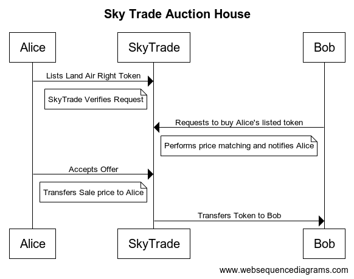

## Overview

The Solana program and TypeScript SDK which facilitates the trading of air-rights on SkyTrade Marketplace. This is a smart contract designed to support trade between compressed nfts, as per the Metaplex Bubblegum standard.

## Sequence Overview

_Sequence Diagram of Auction House_

## Features

- Make Offers on Unlisted Assets: Users can make offers on assets that have not been listed on the platform. This feature enables flexibility in asset transactions and expands the range of available options for users.
- Sell Assets: Facilitates the selling process of assets within the platform. Users can list their assets for sale, providing a streamlined method for asset owners to connect with potential buyers.
- Create Auctions for Your Assets: Empowers users to initiate auctions for their assets. This feature enhances the market dynamics by introducing competitive bidding, potentially maximizing asset value and providing an engaging platform for users.
- Cancel Listings/Offers: Offers flexibility by allowing users to cancel their listings or offers as needed. This feature ensures users have control over their transactions and can adjust them according to changing circumstances.
